# JIMG_analyst_tool - python library

#### JIMG_analyst_tool is a Python library for analyzing high-resolution confocal microscope and flow cytometry images

</br>

<p align="right">
    
    
</p>

</br>

### Author: Jakub Kubiś 

<div align="left">
 Institute of Bioorganic Chemistry<br />
 Polish Academy of Sciences<br />
</div>


## Description


<div align="justify">

 The JIMG_analyst_tool is a Python library that extends the JIMG image processing tool, specifically tailored for analyzing high-resolution confocal microscope images [Opera-Phoenix](https://www.revvity.com/product/opera-phenix-plus-system-hh14001000?srsltid=AfmBOoohz1LiEemNbG4SJnaEtScwr16MyFL8Ulf9NyDDEAffV2NLJXoe) and other technologies. This library enables detailed examination of nuclei and their chromatin organization, supporting high-resolution analysis of nuclear morphology and chromatin structure.

It also provides algorithms for measuring the intensity of specific protein markers using customizable image masks on high-resolution microscope images. These measurements are normalized using a background mask for consistent data comparison. The collected intensity data can be statistically analyzed to detect differences in marker localization, occurrence, and intensity.

In addition to microscopy, flow cytometry [Amnis-ImageStream](https://cytekbio.com/pages/imagestream) analysis capabilities are integrated into the tool. It can analyze flow cytometry images, applying nuclear and chromatin analysis methods similar to those used for confocal microscopy. Furthermore, the tool enables advanced analysis of cell populations from cytometric data, offering options to select distinguishing cell characteristics, perform clustering of cell sets based on these features, and analyze clusters using statistical methods to identify unique attributes.

With these combined functionalities, the JIMG_analyst_tool is a versatile resource for researchers requiring in-depth quantitative analysis of nuclear and chromatin features in both confocal microscopy and flow cytometry datasets.

</div>

</br>


<br />

## Table of contents

1. [Installation](#installation) 
2. [Documentation](#doc)
2. [Example pipelines](#epip) \
2.1. [Nuclei analysis - confocal microscopy](#nacm) \
2.2. [Nuclei analysis - flow cytometry](#nafc) \
2.3. [Clustering and DFA - nuclei data](#cdnd) 


<br />

<br />

# Installation <a id="installation"></a>

#### In command line write:

```
pip install JIMG-analyst-tool>=0.0.5
```


<br />


# Documenation <a id="doc"></a>


# 3. Example pipelines <a id="epip"></a>

If you want to run the examples, you must download the test data. To do this, use:

```
from JIMG_analyst_tool.features_selection import test_data

test_data()
```


<br />

#### 7.1 Nuclei analysis - confocal microscopy <a id="nacm"></a>

```
from JIMG_analyst_tool.features_selection import NucleiFinder


# initiate class
nf = NucleiFinder()


image = nf.load_image('test_data/microscope_nuclei/r01c02f90p20-ch1sk1fk1fl1.tiff')


nf.input_image(image)


# Check the basic parameters
nf.current_parameters_nuclei


# Test nms & prob parmeters for nuclei segmentation
nf.nuclei_finder_test()

nf.browser_test()
```

<br/>

[Browse Raport](https://htmlpreview.github.io/?https://raw.githubusercontent.com/jkubis96/JIMG-analyst-tool/refs/heads/main/fig/Microscope_nuclei/nms_prob_test.html)

<br/>

```
# If required, change parameters
nf.set_nms(nms = 0.9)

nf.set_prob(prob = 0.5)


# Analysis

# 1. First step on nuclei analysis
nf.find_nuclei()


# Parameters for micrsocope image adjustment 
nf.current_parameters_img_adj
```

<br/>

##### Image with 'Default' parameters:
<p align="center">
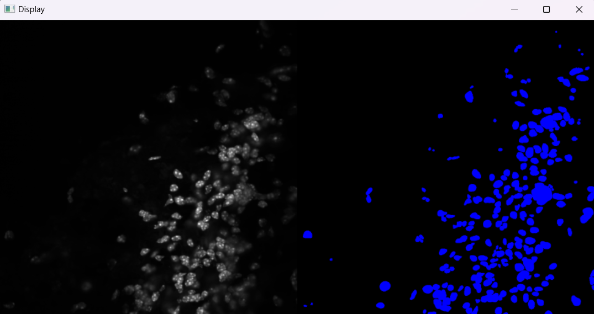
</p>

<br/>

```
# If image required changes, change parameters and run again (nf.find_nuclei())
nf.set_adj_image_brightness(brightness = 1000)

nf.set_adj_image_gamma(gamma = 1.2)

nf.set_adj_image_contrast(contrast = 2)


# Check if parameters has changed
nf.current_parameters_nuclei


# Second execution with new parameters for image adjustment
nf.find_nuclei()
```
<br/>

##### Image with adjusted parameters:

<p align="center">
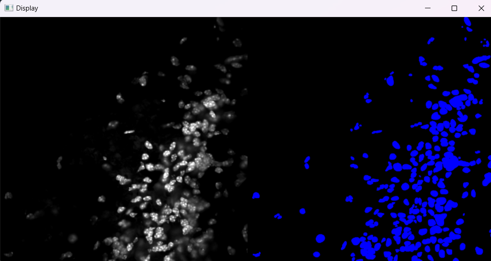
</p>

<br/>

```
# Return results
nuclei_results, analysed_img = nf.get_results_nuclei()
```
<br/>

##### Dictionary with nuclei results:

<p align="center">
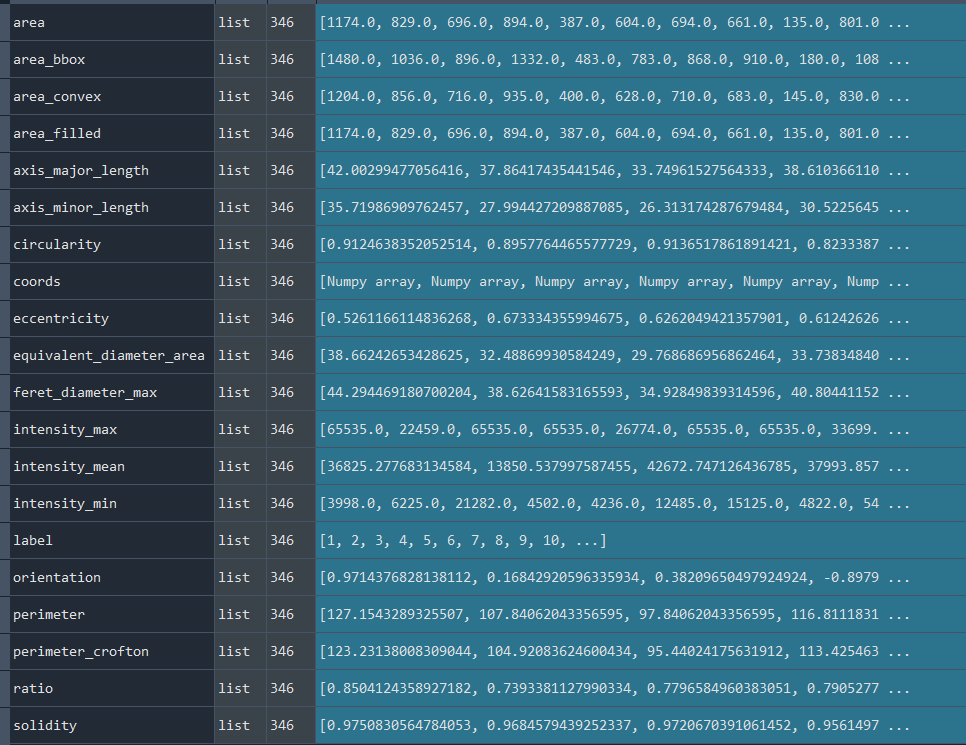
</p>

<br/>

```
# 2. Second step of analysis (selection)
nf.select_nuclei()
```
<br/>

##### Image with 'Default' selection parameters:

<p align="center">
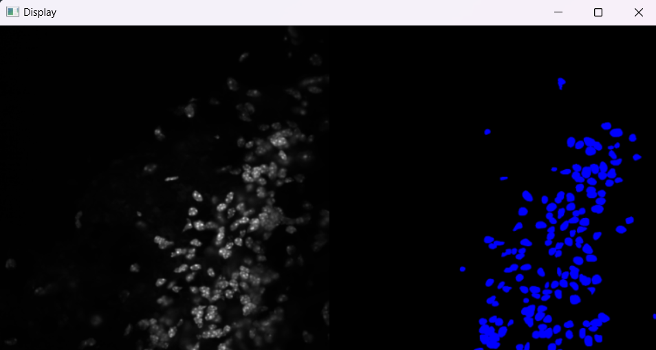
</p>

<br/>

```
# Parameters for selecting nuclei; adjust if analysis results do not meet 
# requirements, and re-run the analysis as needed.
nf.current_parameters_nuclei

nf.set_nuclei_circularity(circ = 0.5)

nf.set_nuclei_yx_len_min_ratio(ratio = 0.2)

nf.set_nuclei_size(size = (100,800))

nf.set_nuclei_min_mean_intensity(intensity = 2000)


# Check if parameters has changed
nf.current_parameters_nuclei


# Second execution with adjusted parameters of second step of analysis (selection)
nf.select_nuclei()
```
<br/>

##### Image with adjusted selection parameters:

<p align="center">
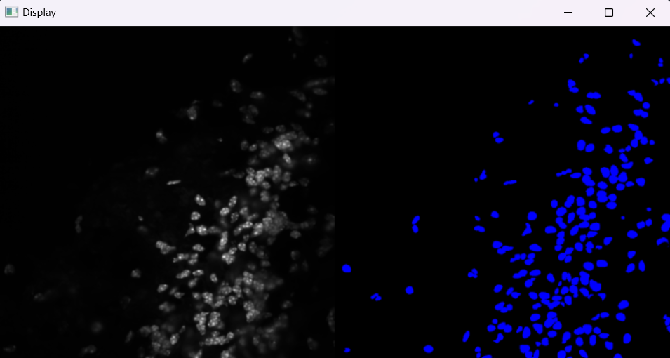
</p>

<br/>

```
# Return results
nuclei_selected_results, analysed_selected_img = nf.get_results_nuclei_selected()
```
<br/>

##### Dictionary with nuclei results:

<p align="center">

</p>

<br/>

```
# 3. third step (chromatinization alaysis)
nf.nuclei_chromatinization()
```
<br/>

##### Image with 'Default' chromatinization parameters:

<p align="center">
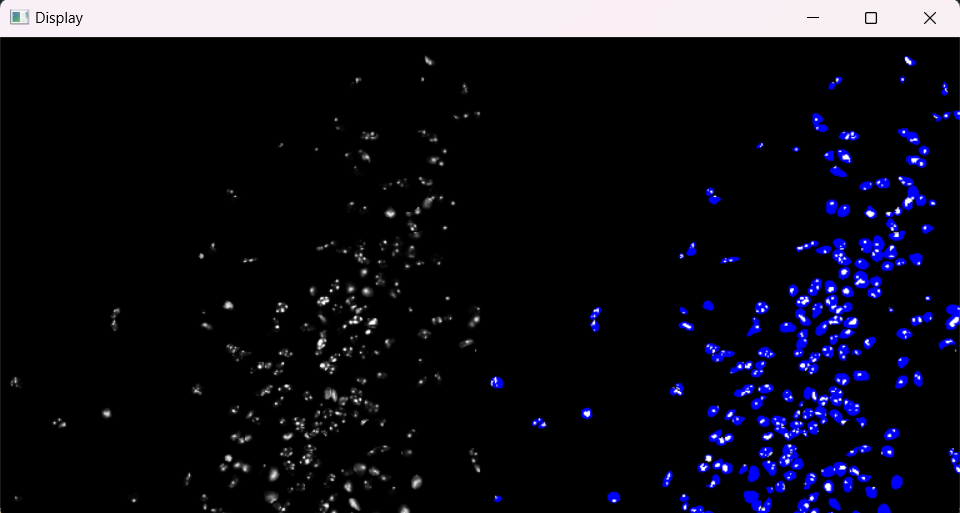
</p>

<br/>

```
# Parameters for nuclei chromatinization; adjust if analysis results do not meet 
# requirements, and re-run the analysis as needed.


# Chromatinization parameters

nf.current_parameters_chromatinization

nf.set_chromatinization_size(size = (2,400))

nf.set_chromatinization_ratio(ratio = .05)

nf.set_chromatinization_cut_point(cut_point = .95)

nf.current_parameters_chromatinization

# Chromatinization image parameters

nf.current_parameters_img_adj_chro

nf.set_adj_chrom_gamma(gamma = 0.25)

nf.set_adj_chrom_contrast(contrast = 3)

nf.set_adj_chrom_brightness(brightness = 950)

nf.current_parameters_img_adj_chro


# Second execution of the third step (chromatinization analysis)
nf.nuclei_chromatinization()
```
<br/>

##### Image with adjusted chromatinization parameters:

<p align="center">
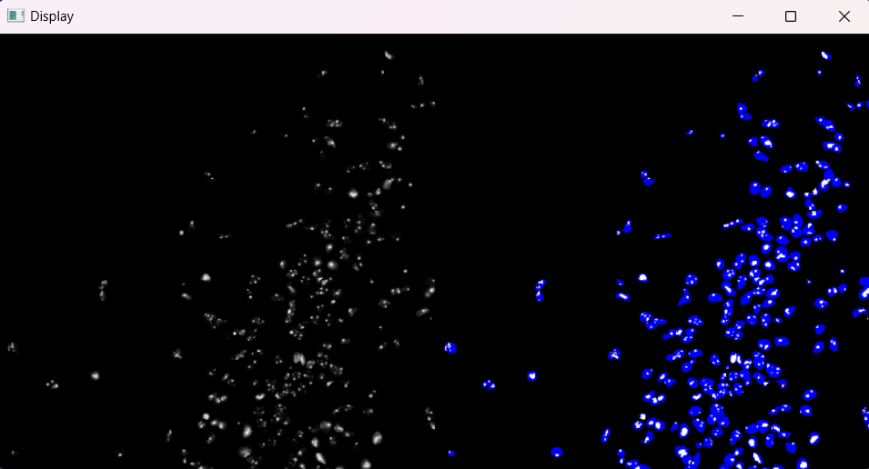
</p>

<br/>

```
# Return results
chromatinization_results, analysed_chromatinization_img = nf.get_results_nuclei_chromatinization()
```
<br/>

##### Dictionary with nuclei chromatinization results:

<p align="center">
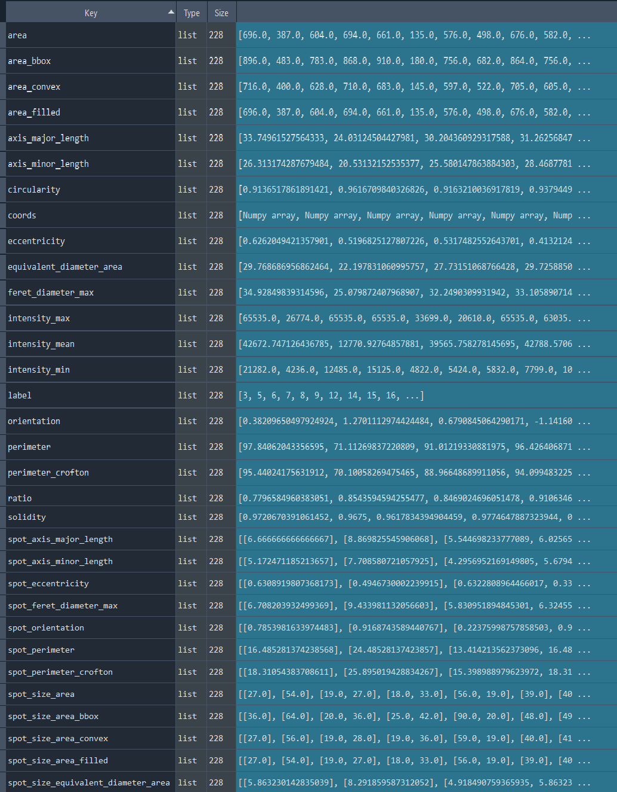
</p>

<br/>

```
# If your parameters are correct for your data, you can run series analysis on more images

# Nuclei 

series_results_nuclei = nf.series_analysis_nuclei(path_to_images = 'test_data/microscope_nuclei', 
                                                  file_extension = 'tiff', 
                                                  selected_id = [], 
                                                  fille_name_part = 'ch1',
                                                  selection_opt = True, 
                                                  include_img = False, 
                                                  test_series = 0)

```
<br/>

##### Dictionary with series nuclei results:

<p align="center">
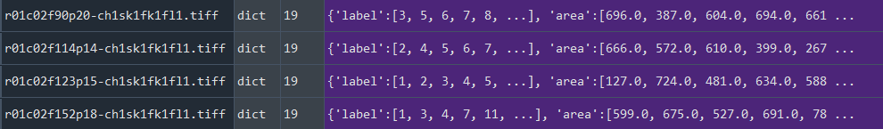
</p>

<br/>

```
# save results

import os
from JIMG_analyst_tool.features_selection import NucleiDataManagement

# initiate class
ndm = NucleiDataManagement()

ndm.save_nuclei_results(path = os.getcwd(), data = series_results_nuclei, id_name = 'example_nuclei')


# Chromatinization 

series_results_chromatinization = nf.series_analysis_chromatinization(path_to_images = 'test_data/microscope_nuclei', 
                                                  file_extension = 'tiff', 
                                                  selected_id = [], 
                                                  fille_name_part = 'ch1',
                                                  selection_opt = True, 
                                                  include_img = True, 
                                                  test_series = 0)

```
<br/>

##### Dictionary with series nuclei chromatinization results:

<p align="center">
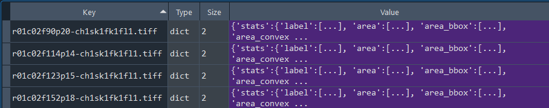
</p>

<br/>

```
# save results
ndm = NucleiDataManagement()

ndm.save_nuclei_results(path = os.getcwd(), data = series_results_chromatinization, id_name = 'example_chromatinization')


###############################################################################

# Nuclei data selection, experiments concatenation and DataFrame creation


ndm = NucleiDataManagement()

ndm.select_nuclei_data(path_to_results = os.getcwd(), 
                       data_sets = ['example_chromatinization'])


data = ndm.get_mutual_data()

```
<br/>

##### Data table with series nuclei chromatinization results:

<p align="center">
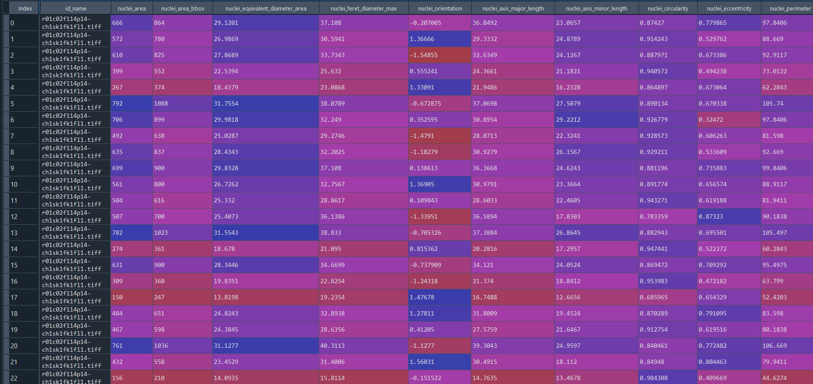
</p>


<br />

<br />

#### 7.2 Nuclei analysis - flow cytometry <a id="nafc"></a>

```

from JIMG_analyst_tool.features_selection import NucleiFinder


# initiate class
nf = NucleiFinder()


image = nf.load_image('test_data/flow_cytometry/ctrl/3087_Ch7.ome.tif')


nf.input_image(image)


# Check the basic parameters
nf.current_parameters_nuclei


# Test nms & prob parmeters for nuclei segmentation
nf.nuclei_finder_test()

nf.browser_test()
```

<br/>

[Browse Raport](https://htmlpreview.github.io/?https://raw.githubusercontent.com/jkubis96/JIMG-analyst-tool/refs/heads/main/fig/FlowCytometry_nuclei/nms_prob_test.html)

<br/>

```
# If required, change parameters
nf.set_nms(nms = 0.6)

nf.set_prob(prob = 0.3)


# Analysis

# 1. First step on nuclei analysis
nf.find_nuclei()
```

<br/>

##### Image with 'Default' parameters:
<p align="center">
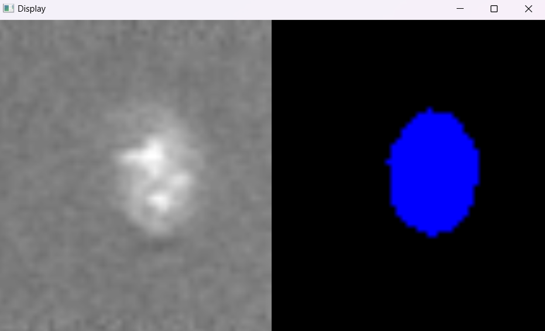
</p>

<br/>

```
# Parameters for micrsocope image adjustment 
nf.current_parameters_img_adj


# If image required changes, change parameters and run again (nf.find_nuclei())
nf.set_adj_image_brightness(brightness = 1000)

nf.set_adj_image_gamma(gamma = 1.2)

nf.set_adj_image_contrast(contrast = 2)


# Check if parameters has changed
nf.current_parameters_nuclei


# Second execution with new parameters for image adjustment
nf.find_nuclei()
```
<br/>

##### Image with adjusted parameters:

<p align="center">
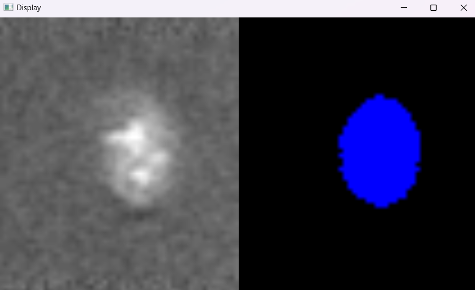
</p>

<br/>

```
# Return results
nuclei_results, analysed_img = nf.get_results_nuclei()
```
<br/>

##### Dictionary with nuclei results:

<p align="center">
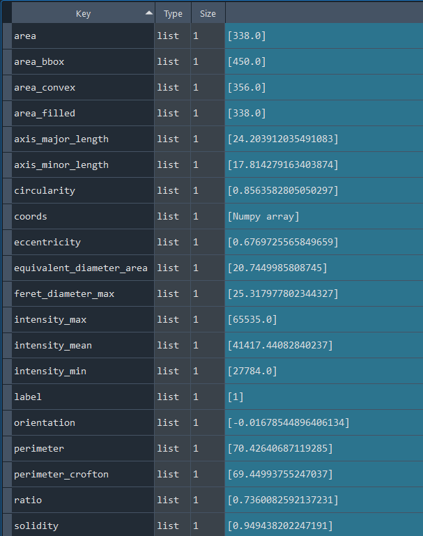
</p>

<br/>

```
# 2. Second step of analysis (selection)
nf.select_nuclei()
```
<br/>

##### Image with 'Default' selection parameters:

<p align="center">

</p>

<br/>

```
# Parameters for selecting nuclei; adjust if analysis results do not meet 
# requirements, and re-run the analysis as needed.
nf.current_parameters_nuclei

nf.set_nuclei_circularity(circ = 0.5)

nf.set_nuclei_yx_len_min_ratio(ratio = 0.2)

nf.set_nuclei_size(size = (100,800))

nf.set_nuclei_min_mean_intensity(intensity = 2000)


# Check if parameters has changed
nf.current_parameters_nuclei


# Second execution with adjusted parameters of second step of analysis (selection)
nf.select_nuclei()
```
<br/>

##### Image with adjusted selection parameters:

<p align="center">

</p>

<br/>

```
# Return results
nuclei_selected_results, analysed_selected_img = nf.get_results_nuclei_selected()
```
<br/>

##### Dictionary with nuclei results:

<p align="center">

</p>

<br/>

```
# 3. third step (chromatinization alaysis)
nf.nuclei_chromatinization()
```
<br/>

##### Image with 'Default' chromatinization parameters:

<p align="center">
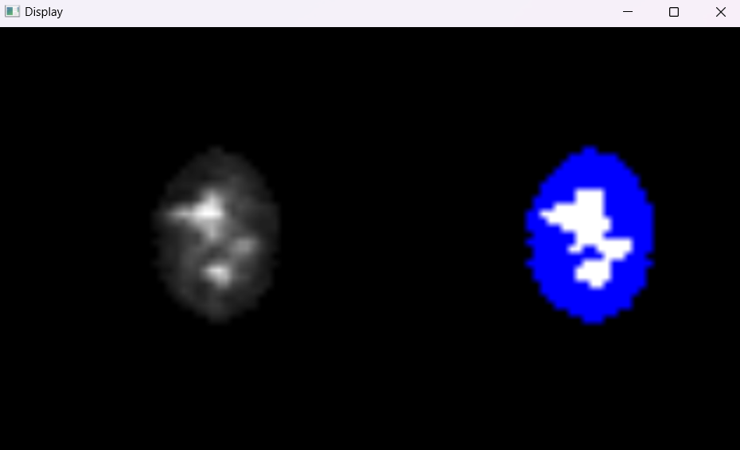
</p>

<br/>

```
# Parameters for nuclei chromatinization; adjust if analysis results do not meet 
# requirements, and re-run the analysis as needed.


# Chromatinization parameters
nf.current_parameters_chromatinization

nf.set_chromatinization_size(size = (2,1000))

nf.set_chromatinization_ratio(ratio = 0.005)

nf.set_chromatinization_cut_point(cut_point = 1.05)

nf.current_parameters_chromatinization


# Chromatinization image parameters
nf.current_parameters_img_adj_chro

nf.set_adj_chrom_gamma(gamma = 0.25)

nf.set_adj_chrom_contrast(contrast = 4)

nf.set_adj_chrom_brightness(brightness = 950)

nf.current_parameters_img_adj_chro


# Second execution of the third step (chromatinization analysis)
nf.nuclei_chromatinization()
```
<br/>

##### Image with adjusted chromatinization parameters:

<p align="center">
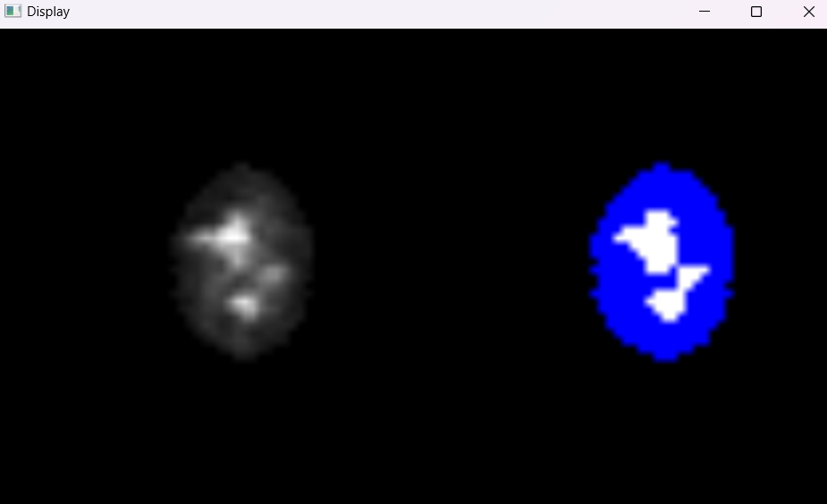
</p>

<br/>

```
# Return results
chromatinization_results, analysed_chromatinization_img = nf.get_results_nuclei_chromatinization()
```
<br/>

##### Dictionary with nuclei chromatinization results:

<p align="center">
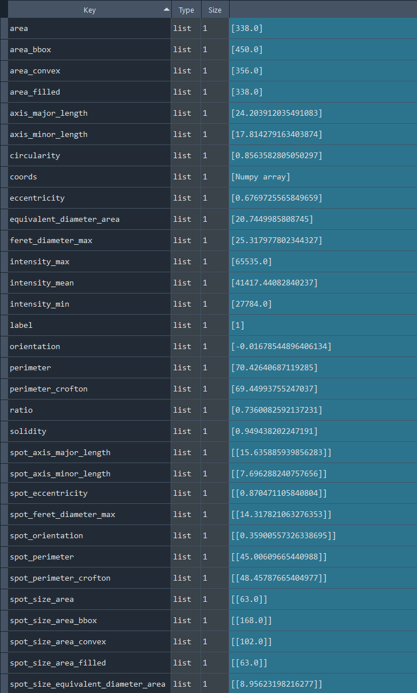
</p>

<br/>

```
# If your parameters are correct for your data, you can run series analysis on more images


# Chromatinization CTRL CELLS
series_results_chromatinization = nf.series_analysis_chromatinization(path_to_images = 'test_data/flow_cytometry/ctrl', 
                                                  file_extension = 'tif', 
                                                  selected_id = [], 
                                                  selection_opt = True, 
                                                  include_img = False, 
                                                  test_series = 0)


```
<br/>

##### Dictionary with series nuclei chromatinization results:

<p align="center">
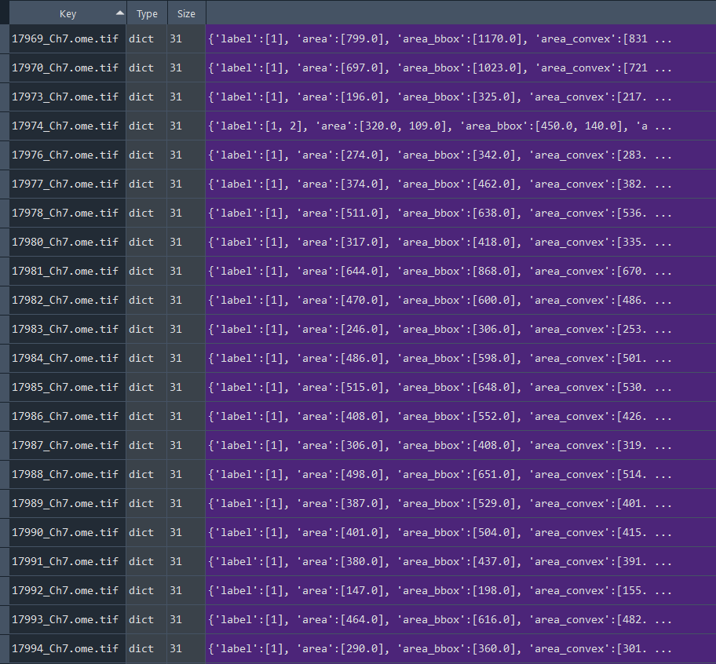
</p>

<br/>

```
import os
from JIMG_analyst_tool.features_selection import NucleiDataManagement

# initiate class
ndm = NucleiDataManagement()

ndm.save_nuclei_results(path = os.getcwd(), data = series_results_chromatinization, id_name = 'ctrl_chromatinization')


# Chromatinization DISEASE CELLS

series_results_chromatinization = nf.series_analysis_chromatinization(path_to_images = 'test_data/flow_cytometry/dis', 
                                                  file_extension = 'tif', 
                                                  selected_id = [], 
                                                  selection_opt = True, 
                                                  include_img = False, 
                                                  test_series = 0)

```
<br/>

##### Dictionary with series nuclei chromatinization results:

<p align="center">

</p>

<br/>

```
# save results
ndm = NucleiDataManagement()

ndm.save_nuclei_results(path = os.getcwd(), data = series_results_chromatinization, id_name = 'disease_chromatinization')


###############################################################################

# Nuclei data selection, experiments concatenation and DataFrame creation


ndm = NucleiDataManagement()

ndm.select_nuclei_data(path_to_results = os.getcwd(), 
                       data_sets = ['ctrl_chromatinization', 'disease_chromatinization'])


nuclei_data = ndm.get_mutual_data()

import pandas as pd

features_list = pd.read_csv('test_data/flow_cytometry/ctrl.txt', sep='\t', header=1, nrows=0).columns.tolist()

# reduce features - to exclude

to_reduce = ['Object Number.1', 'Camera Timer', 'Camera Line Number', 
             'Raw Centroid X', 'Raw Centroid Y', 'Time']

reduced_features_list = [col for col in features_list if col not in to_reduce]

ndm.concat_IS_results(nuclei_data, 
                      data_sets = ['ctrl', 'dis'], 
                      IS_data_path = 'test_data/flow_cytometry', 
                      IS_features = reduced_features_list)


data = ndm.get_mutual_IS_data()
```
<br/>

##### Data table showing chromatinization results for nuclear series across both concatenated experiments:

<p align="center">
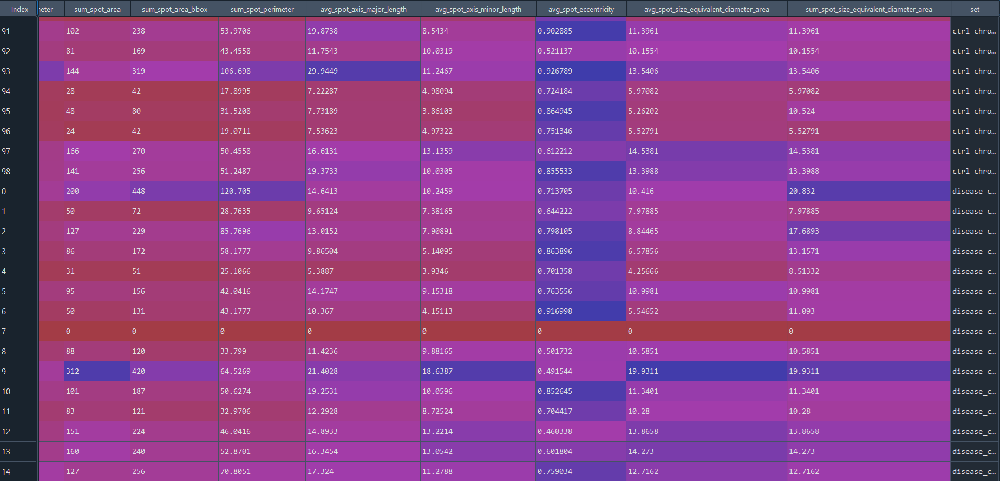
</p>

<br/>

```
# save to csv

data.to_csv('dis_vs_ctrl_nuclei.csv', index = False)
```


<br />
<br />


#### 7.3 Clustering and DFA - nuclei data <a id="cdnd"></a>

```
from JIMG_analyst_tool.features_selection import GroupAnalysis

# initiate class
ga = GroupAnalysis()


# load data from csv file
ga.load_data(path = 'test_data/DFA/dis_vs_ctrl_nuclei.csv',
          ids_col = 'id_name', 
          set_col = 'set')


# check available groups for selection of differential features
ga.groups

# run DFA analysis on example sets
group_diff_features = ga.DFA(meta_group_by = 'sets',
    sets = {'disease':['disease_chromatinization'],
            'ctrl':['ctrl_chromatinization']}, 
    n_proc = 5)

```
<br/>

##### Data table presenting statistical analysis of differential features:

<p align="center">
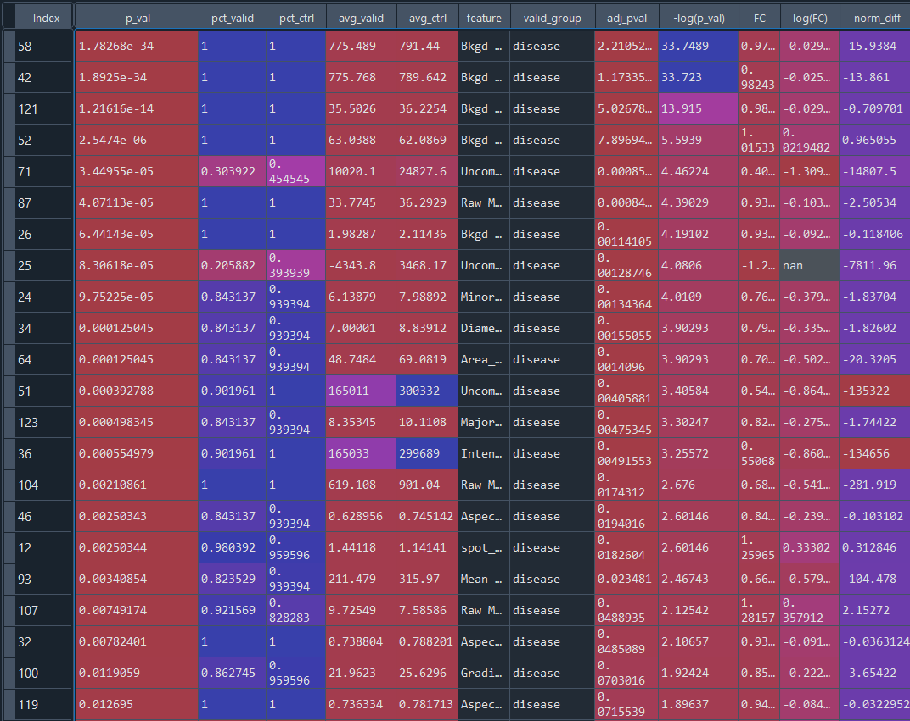
</p>

<br/>

```
# select differential features

diff_features = list(group_diff_features['feature'][group_diff_features['p_val'] <= 0.05])

ga.select_data(features_list = diff_features)


# scale data
ga.data_scale()


# run PCA dimensionality reduction
ga.PCA()


# get PCA data, if required
pca_data = ga.get_PCA()


# run PC variance analysis
ga.var_plot()


# get var_data, if required
var_data = ga.get_var_data()


# get knee_plot, if required
knee_plot = ga.get_knee_plot(show = True)
```
<br/>

##### Knee plot - cumulative explanation of variance:

<p align="center">
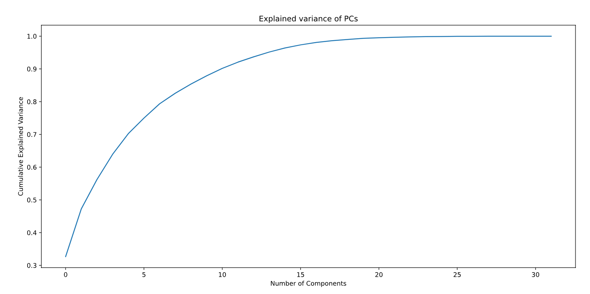
</p>

<br/>

```
# save knee_plot, if required
ga.save_knee_plot(path = os.getcwd(),
               name = '', 
               extension = 'svg')


# run UMAP dimensionality reduction
ga.UMAP(PC_num = 15,
     factorize_with_metadata = True, 
     n_neighbors = 25,
     min_dist = 0.01,
     n_components = 2)


# get UMAP_data, if required
UMAP_data = ga.get_UMAP_data()


# get UMAP_plots, if required
UMAP_plots = ga.get_UMAP_plots(show = True)
```
<br/>

##### UMAP plot - primary clusters description (sets):

<p align="center">
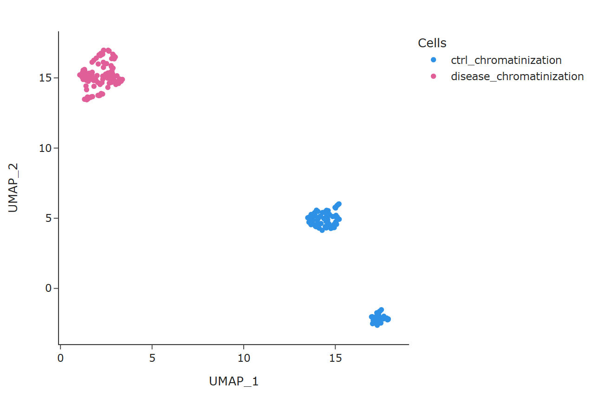
</p>

<br/>

```
# save UMAP_plots, if required
ga.save_UMAP_plots(path = os.getcwd(),
                name = '', 
                extension = 'svg')


# run db_scan on UMAP components
ga.db_scan(eps = 0.5,
        min_samples = 10)


# run UMAP_on_clusters
ga.UMAP_on_clusters(min_entities = 10)


# get UMAP_plots, if required
UMAP_plots = ga.get_UMAP_plots(show = True)
```
<br/>

##### UMAP plot - db_scan clusters:

<p align="center">
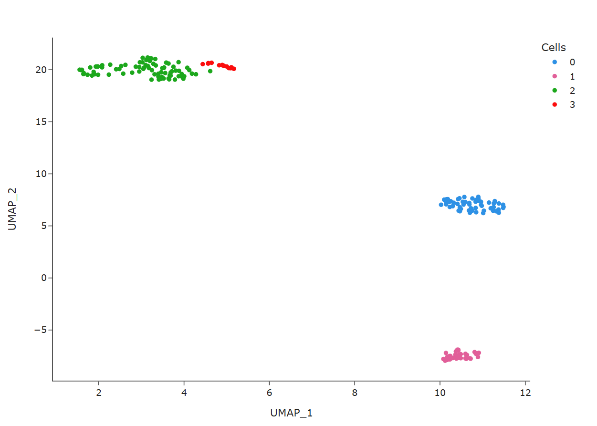
</p>

<br/>


##### UMAP plot -  set / cluster combination:

<p align="center">
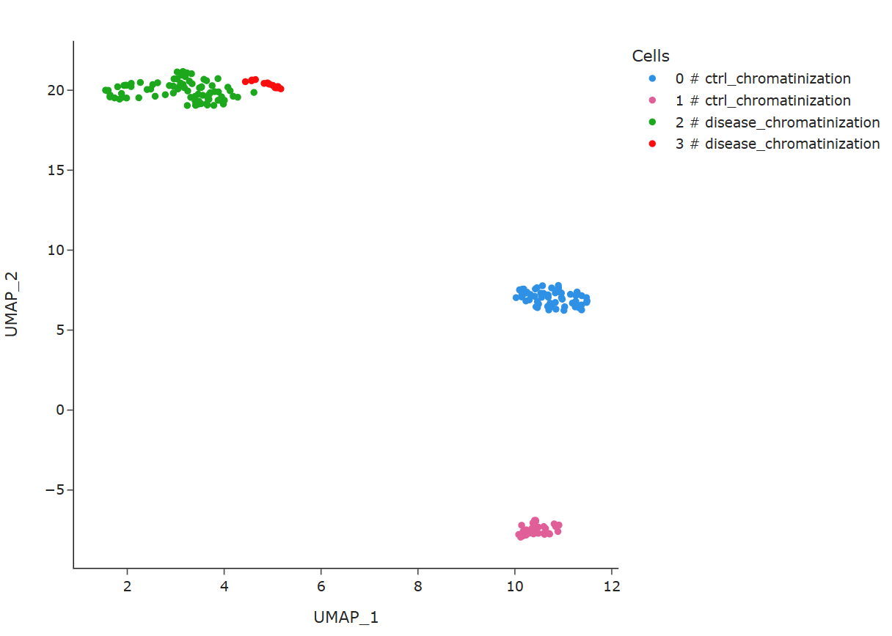
</p>

<br/>

```
# save UMAP_plots, if required
ga.save_UMAP_plots(path = os.getcwd(),
                name = '', 
                extension = 'svg')


# get full_data [data + metadata], if required
full_data = ga.full_info()


# check available groups for selection of differential features
ga.groups


# run DFA analysis on finl clusters
dfa_clusters = ga.DFA(meta_group_by = 'full_name',
    sets = {}, 
    n_proc = 5)

```
<br/>

##### Data table presenting statistical analysis of differential features for final clusters:

<p align="center">

</p>


<br />
<br />


#### 7.4 Marker intensity analysis - confocal microscopy <a id="miacm"></a>

##### 7.4.1 Data collection <a id="miacmdc"></a>


```
from JIMG_analyst_tool.features_selection import FeatureIntensity

# Select intenity are data for 1st Image - healthy

# initiate class
fi = FeatureIntensity()

# check current metadata
fi.current_metadata

# if required, change parameters
fi.set_projection(projection = 'avg')

fi.set_correction_factorn(factor = 0.2)

# fi.set_scale(scale = 0.5)
# fi.set_selection_list(rm_list = [2,5,6,7])
# OR
# load JIMG project where scale and rm_lis is set in project metadata
# fi.load_JIMG_project_(path = '')
# for more information go to: https://github.com/jkubis96/JIMG
# rm_list and scale can be omitted

# load image
fi.load_image_3D(path = 'test_data/intensity/ctrl/image.tiff')

# or 1D image after projection, be sure that image was not adjusted, for analysis should be use !RAW! image
# fi.load_image_(path)
```
<br/>

##### Analysed image projection (after projection with JIMG)

* input image in this case is raw 3D-image in *.tiff format

<p align="center">

</p>

<br/>

```
fi.load_mask_(path = 'test_data/intensity/ctrl/mask_1.png')
```
<br/>

##### Analysed image region mask


<p align="center">

</p>

<br/>

```
fi.load_normalization_mask_(path = 'test_data/intensity/ctrl/background_1.png')
```
<br/>

##### Normalization region mask (reversed)


<p align="center">

</p>

<br/>

```
# strat calculations
fi.run_calculations()


# get results
results = fi.get_results()


# save results for further analysis, ensuring each feature 
# is stored in a separate directory (single directory 
# should contain data with the same 'feature_name'),
# this setup allows running fi.concatenate_intensity_data() 
# in the specific directory of each feature
# while preventing errors from incorrect feature concatenation

fi.save_results(path = os.getcwd(), 
             mask_region = 'brain', 
             feature_name = 'Feature1', 
             individual_number = 1, 
             individual_name = 'CTRL')


###############################################################################


# Select intenity are data for 2st Image - disease

# initiate class
fi = FeatureIntensity()

fi.set_projection(projection = 'avg')

fi.set_correction_factorn(factor = 0.2)

fi.load_image_3D(path = 'test_data/intensity/dise/image.tiff')
```
<br/>

##### Analysed image projection (after projection with JIMG)

* input image in this case is raw 3D-image in *.tiff format

<p align="center">

</p>

<br/>

```
fi.load_mask_(path = 'test_data/intensity/dise/mask_1.png')
```
<br/>

##### Analysed image region mask


<p align="center">

</p>

<br/>

```
fi.load_normalization_mask_(path = 'test_data/intensity/dise/background_1.png')
```
<br/>

##### Normalization region mask (reversed)


<p align="center">

</p>

<br/>

```
fi.run_calculations()

results = fi.get_results()

fi.save_results(path = os.getcwd(), 
             mask_region = 'brain', 
             feature_name = 'Feature1', 
             individual_number = 1, 
             individual_name = 'DISEASE')


# concatenate data of experiment 1 & 2
fi.concatenate_intensity_data(directory = os.getcwd(), name = 'example_data')
```

<br />

##### 7.4.2 Data analysis <a id="miacmda"></a>

```
from JIMG_analyst_tool.features_selection import IntensityAnalysis
import pandas as pd


# initiate class
ia = IntensityAnalysis()


input_data = pd.read_csv('example_data_Feature1_brain.csv')

# check columns
input_data.head()

data = ia.df_to_percentiles(data = input_data,
                                       group_col = 'individual_name',
                                       values_col = 'norm_intensity', sep_perc = 1)


results = ia.hist_compare_plot(data = data,
                               queue = ['CTRL', 'DISEASE'],
                               tested_value = 'avg', p_adj = True, txt_size = 20)


```
<br/>

##### Results of intensity comparison analysis (region under the mask)

<p align="center">

</p>

<br/>

```
results.savefig('example_results.svg', format = 'svg', dpi = 300, bbox_inches = 'tight')
```

<br />
<br />

### Have fun JBS